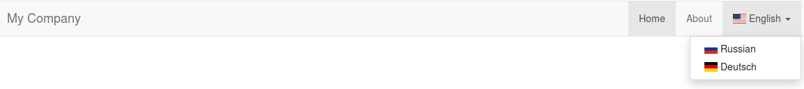
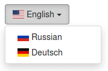
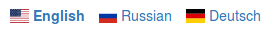

Language Selector
=================

[](https://travis-ci.org/cetver/yii2-language-selector)
[](https://coveralls.io/github/cetver/yii2-language-selector?branch=master)

Provides the configuration for the language selector

Installation
------------

The preferred way to install this extension is through [composer](http://getcomposer.org/download/).

Either run

```
composer require --prefer-dist cetver/yii2-language-selector
```

or add

```
"cetver/yii2-language-selector": "^1.0"
```

to the require section of your `composer.json` file.


Usage
-----

### Bootstrap Nav

```php
 Yii::$app->language = 'en';
 $languageItem = new cetver\LanguageSelector\items\DropDownLanguageItem([
     'languages' => [
         'en' => '<span class="flag-icon flag-icon-us"></span> English',
         'ru' => '<span class="flag-icon flag-icon-ru"></span> Russian',
         'de' => '<span class="flag-icon flag-icon-de"></span> Deutsch',
     ],
     'options' => ['encode' => false],
 ]);
 \yii\bootstrap\NavBar::begin([
     'brandLabel' => 'My Company',
     'brandUrl' => Yii::$app->homeUrl,
 ]);
 echo \yii\bootstrap\Nav::widget([
     'options' => ['class' => 'navbar-nav navbar-right'],
     'items' => [
         ['label' => 'Home', 'url' => ['/site/index']],
         ['label' => 'About', 'url' => ['/site/about']],
         $languageItem->toArray()
     ]
 ]);
 \yii\bootstrap\NavBar::end();
```



### Bootstrap Drop-Down Button

```php
 Yii::$app->language = 'en';
 $languageItem = new cetver\LanguageSelector\items\DropDownLanguageItem([
     'languages' => [
         'en' => '<span class="flag-icon flag-icon-us"></span> English',
         'ru' => '<span class="flag-icon flag-icon-ru"></span> Russian',
         'de' => '<span class="flag-icon flag-icon-de"></span> Deutsch',
     ],
     'options' => ['encode' => false],
 ]);
 $languageItem = $languageItem->toArray();
 $languageDropdownItems = \yii\helpers\ArrayHelper::remove($languageItem, 'items');
 echo \yii\bootstrap\ButtonDropdown::widget([
     'label' => $languageItem['label'],
     'encodeLabel' => false,
     'options' => ['class' => 'btn-default'],
     'dropdown' => [
         'items' => $languageDropdownItems
     ]
 ]);
```



### Menu

```php
$languageItems = new cetver\LanguageSelector\items\MenuLanguageItems([
     'languages' => [
         'en' => '<span class="flag-icon flag-icon-us"></span> English',
         'ru' => '<span class="flag-icon flag-icon-ru"></span> Russian',
         'de' => '<span class="flag-icon flag-icon-de"></span> Deutsch',
     ],
     'options' => ['encode' => false],
 ]);
 echo \yii\widgets\Menu::widget([
     'options' => ['class' => 'list-inline'],
     'items' => $languageItems->toArray(),
 ]);
```



Configuration
-------------

### Drop-Down

```php
new cetver\LanguageSelector\items\DropDownLanguageItem([
    // the list of available languages
    'languages' => [
        'en' => 'English',
        'ru' => 'Russian',
        'de' => 'Deutsch',
    ],
    /*
    or
    'languages' => function () {
       return \app\models\Language::find()
                    ->select(['code', 'name'])
                    ->createCommand()
                    ->queryAll(\PDO::FETCH_KEY_PAIR);
    },
    */
    // the drop-down widget item options, excluding "label" and "url"
    // @see \yii\bootstrap\Nav::$items
    // @see \yii\bootstrap\Dropdown::$items
    'options' => [
        'visible' => true
    ]
]);
```

### Menu

```php
new cetver\LanguageSelector\items\MenuLanguageItems([
    // the list of available languages
    'languages' => [
        'en' => 'English',
        'ru' => 'Russian',
        'de' => 'Deutsch',
    ],
    /*
    or
    'languages' => function () {
       return \app\models\Language::find()
                    ->select(['code', 'name'])
                    ->createCommand()
                    ->queryAll(\PDO::FETCH_KEY_PAIR);
    },
    */
    // the menu widget item options, excluding "label", "url" and "active"
    // @see \yii\widgets\Menu::$items
    'options' => [
        'visible' => true
    ]
]);
```

Tests
-----

Run the following commands

```
composer create-project --prefer-source cetver/yii2-language-selector
cd yii2-language-selector
vendor/bin/codecept run unit
```

For I18N support, take a look at
-------------------------------------
- [https://github.com/cetver/yii2-languages-dispatcher](https://github.com/cetver/yii2-languages-dispatcher) - Sets the web-application language
- [https://github.com/cetver/yii2-language-url-manager](https://github.com/cetver/yii2-language-url-manager) - Parses and creates URLs containing languages
- [https://github.com/cetver/yii2-language-selector](https://github.com/cetver/yii2-language-selector) - Provides the configuration for the language selector
- [https://github.com/creocoder/yii2-translateable](https://github.com/creocoder/yii2-translateable) - The translatable behavior (Active Record)
